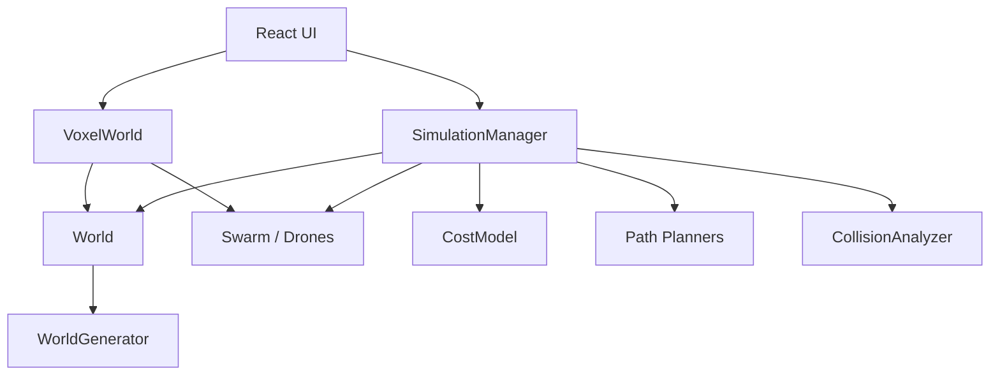

# System Architecture

## 1. Architectural Decomposition

The project is organized as a simulation kernel plus a visualization shell.

- The simulation kernel is implemented in TypeScript classes.
- The frontend is implemented with React and React Three Fiber.
- The UI does not perform planning itself; it configures and visualizes the results of the planning layer.

At a high level:

1. `SimulationManager` builds the world and initializes the swarm.
2. It repeatedly allocates missions and plans one leg at a time.
3. The resulting paths are stored as deterministic arrays.
4. React replays those arrays using a discrete global tick.

## 2. Main Runtime Objects

### 2.1 `World`

[`classes/World.ts`](/Users/lgr03/Documents/MDU_PhD/dev/Multi-Drone-Path-Planner-Visualizer-/classes/World.ts) stores:

- `size`,
- a flattened obstacle grid `Uint8Array`,
- obstacle coordinates,
- charge stations,
- warehouse metadata,
- pallets,
- forklift trajectories.

For a voxel \((x,y,z)\), the linearized storage index is

\[
\operatorname{idx}(x,y,z) = x + S(y + Sz),
\]

where \(S\) is the grid side length.

### 2.2 `Swarm` and `Drone`

[`classes/Drone.ts`](/Users/lgr03/Documents/MDU_PhD/dev/Multi-Drone-Path-Planner-Visualizer-/classes/Drone.ts) defines both the `Drone` class and the `Swarm` container.

Each drone stores:

- start and goal voxels,
- a precomputed path,
- battery state,
- payload capabilities,
- mission controller state,
- scan history,
- assignment history,
- optional destruction time.

### 2.3 `SimulationManager`

[`classes/SimulationManager.ts`](/Users/lgr03/Documents/MDU_PhD/dev/Multi-Drone-Path-Planner-Visualizer-/classes/SimulationManager.ts) is the orchestration layer. It is responsible for:

- world generation,
- agent initialization,
- allocation-mode selection,
- leg-by-leg planning,
- reservation-table population,
- post hoc incident analysis,
- experiment helpers.

### 2.4 `PathFindingStrategy`

[`classes/PathPlanner.ts`](/Users/lgr03/Documents/MDU_PhD/dev/Multi-Drone-Path-Planner-Visualizer-/classes/PathPlanner.ts) defines the planning interface and the concrete planners.

### 2.5 `CostModel`

[`classes/CostModel.ts`](/Users/lgr03/Documents/MDU_PhD/dev/Multi-Drone-Path-Planner-Visualizer-/classes/CostModel.ts) contains:

- energy-feasibility screening,
- scalar task costs,
- dense cost-matrix construction,
- Hungarian assignment.

## 3. Data Flow

## 4. Execution Structure

The simulation is precomputed before playback.

This means the engine does not plan inside the render loop. Instead:

1. `runPathfinding(...)` plans a complete multi-leg history.
2. The frontend stores cloned drone states.
3. Playback increments a discrete tick with `setInterval`.
4. Visual state at time \(t\) is reconstructed from the precomputed path arrays and battery bookkeeping.

## 5. Architectural Consequences

This separation has three important consequences.

- The visual layer is deterministic with respect to the planned paths.
- Experiments can be replayed exactly for a fixed random seed realization.
- The simulation core is conceptually portable to Web Workers, although worker execution is not currently implemented.
