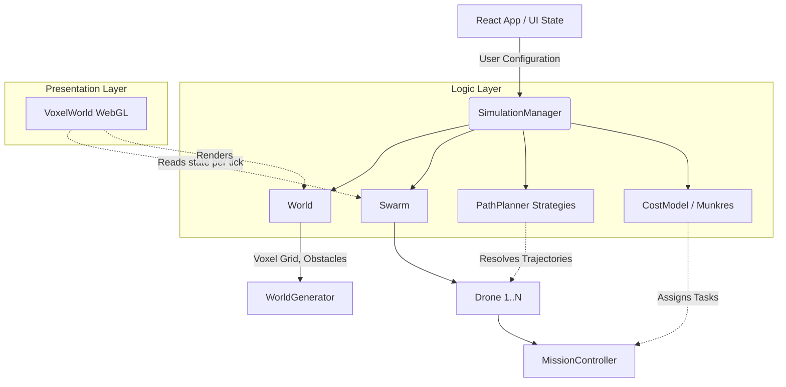

# System Architecture

## 1. High-Level Architectural Paradigm

VoxelSwarm adopts a strictly decoupled architecture, enforcing a rigid boundary between the **Simulation Engine** (State & Compute) and the **Presentation Layer** (Rendering). This paradigm is essential for minimizing frame drops during intense computational bursts (e.g., executing A* across a dense Time-Expanded Graph) and allows the logical kernel to exist purely as standard TypeScript models.

### 1.1 Technology Stack
*   **Runtime**: Browser execution via V8 Engine.
*   **Presentation**: React 19 (DOM Binding) + React Three Fiber / Three.js (WebGL rendering).
*   **Development Logic**: Pure TypeScript using heavily Object-Oriented patterns (Classes, Interfaces) for mathematical representations independent of the DOM.
*   **State Management**: Hybrid Architecture. We utilize strictly **Mutable Classes for Physics/Simulation** (`Drone`, `SimulationManager`) yielding performance, paired with **React State for UI** (`App.tsx`) rendering outputs conditionally.

---

## 2. Component Layout and Data Flow

The core system is orchestrated by the `SimulationManager`, a singleton-like controller that owns the World and Swarm domains.

### 2.1 The Logic Layer
*   **SimulationManager**: Central coordinator. Manages the tick loop, collision analysis, and triggering pathfinding batches.
*   **World**: Represents the $\mathbb{Z}^3$ discretized topology. Handles static obstacle mapping using a flat `Uint8Array` for memory-contiguous, cache-friendly lookups.
*   **Swarm & Drones**: State machines encapsulating kinematic history (`path: Position3D[]`). The `calculateStateAt(tick)` function allows pure deterministic resolution of a drone's battery, status, and location at any timestamp.
*   **CostModel (Task Allocation)**: Calculates composite energy/distance costs and utilizes the Hungarian algorithm (`munkres-js`) for $O(N^3)$ optimal linear assignment.
*   **PathPlanner**: A Strategy Pattern host for A* variants navigating dynamic Space-Time reservation tables.

### 2.2 The Presentation Layer
*   **React Three Fiber (R3F)**: Declarative scene graph mapping.
*   **InstancedMesh**: To maintain 60 FPS while rendering thousands of obstacle voxels, Three.js `InstancedMesh` is employed, enabling rendering in $O(1)$ draw calls by pushing transformation matrices directly to the GPU.
*   **Transient Updates**: `useFrame` hooks bypass the React reconciler, directly mutating object `.position` and `.rotation` based on the deterministic tick rate, preventing excessive Garbage Collection (GC) pauses.

---

## 3. Control Flow: Execution Loop

1.  **Task Generation**: `SimulationManager` uses `generateRandomTask` or defines warehouse pallets as targets.
2.  **Global Assignment**: `CostModel.executeOptimalAllocation()` forms a bipartite graph between active drones and available tasks, returning an optimal assignment matrix.
3.  **Prioritized Path Planning**: The assigned tasks are fed into the current `PathFindingStrategy`. Drones plan sequentially, appending their $4D$ trajectories $(x, y, z, t)$ into a central `reservedSpaceTime` hash set to prevent future collisions.
4.  **Simulation Playback**: The UI increments a global `tick` counter via `requestAnimationFrame`. Drones look up `trajectory[tick]` and `calculateStateAt(tick)` to render their correct physical state.

---

## 4. Extensibility

The decoupled architecture natively supports future expansion into more rigorous academic evaluations:
*   **WebWorkers**: Because the `SimulationManager` strictly utilizes pure TypeScript arrays and mathematical classes (no implicit dependencies on the DOM or `Three.js` window buffers), the entire pathfinding execution loop can be trivially exported to a background WebWorker thread, completely preventing any UI stutter during densely populated graph searches.
*   **Continuous Space Formulation**: The base `Drone` entity class can be subclassed to support absolute floating-point coordinates. The abstract `PathFindingStrategy` could be extended to implement Any-Angle algorithms (e.g., Theta*), allowing visual sweeps over continuous trajectories rather than grid-locked $\mathbb{Z}^3$ paths.
